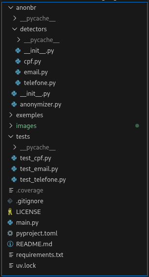
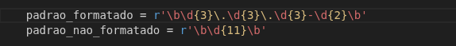
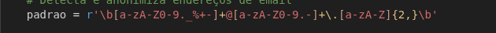
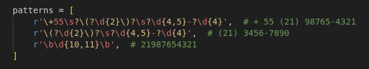
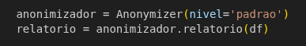
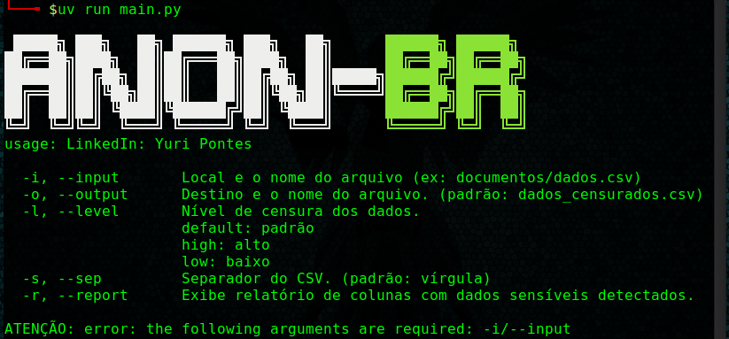
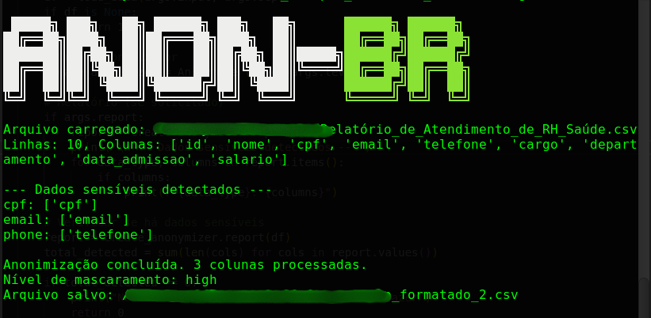

<h1>&nbsp;&nbsp;Anonbr</h1>


[](https://github.com/yurivski/anonbr/actions/workflows/tests.yml)


Biblioteca Python para detectar e mascarar dados pessoais sensíveis em DataFrames.

Este projeto nasceu após eu identificar em alguns posts do LinkedIn em que devs e analistas ficam P* da vida com DBAs (ou quem quer que seja) que não liberam acesso ao banco de dados para o desenvolvimento ou testes. Identifica automaticamente [CPF](#cpf), [email](#email) e [Telefone](#telefone) em colunas e aplica mascaramento com [três níveis de privacidade.](#níveis-de-mascaramento)  

> [**Contribua sem comprimisso**](/CONTRIBUTING.md), vamos escrever códigos bugados e desbugar **em prol do desenvolvimento pessoal e profissional.** Sintam-se livres para contribuir implementando novas funcionalidades, relatando erros ou sugestões. 

*Leia o [**CONTRIBUTING.md**](/CONTRIBUTING.md) para mais detalhes.*

## Introdução

O projeto foi desenvolvido para estimular programadores de Júniors a Sêniors nos estudos e treinamentos de conceitos tanto de Python quanto de Versionamento, aplicados a um projeto, inicialmente simples de biblioteca de mascaramento com foco na **LGPD** (Lei Geral de Proteção de Dados) e no **tratamento de dados pessoais no contexto brasileiro**.  

***Todos os dados sensíveis expostos neste repositório são fictícios, gerados por IA como ilustração para exibição de testes.***

### CLIQUE AQUI
- [**EXEMPLOS DE OUTPUTS EM CADA NÍVEL DE CENSURA**](/OUTPUT_EXEMPLE.md)   
- [**HISTÓRICO DE ATUALIZAÇÕES E VERSÕES**](/UPDATES.md)


## SUMÁRIO  
[**#1** - RESUMO DAS FUNCIONALIDADES E EXEMPLO DE MASCARAMENTO](#funcionalidades---resumo)  
[**#2** - ARQUITETURA DO PROJETO](#arquitetura-do-projeto)  
[**#3** - COMO FUNCIONA A DETECÇÃO](#como-funciona-a-detecção)  
[**#4** - COMO FUNCIONA O MASCARAMENTO](#como-funciona-o-mascaramento)  
[**#5** - CASO DE USO](#caso-de-uso)  
[**#6** - CONFIGURAÇÃO DO AMBIENTE](#configuração-do-ambiente)  
[**#7** - EXECUÇÃO DA FERRAMENTA](#execução)  
[**#8** - LISTA DE COMANDOS](#lista-de-comandos)  
[**#9** - TECNOLOGIAS](#tecnologias)  
[**#10** - AUTOR](#autor)  


## Funcionalidades - RESUMO

Censura dados sensíveis em arquivos CSV e PDF sem quebrar a estrutura do arquivo, com três níveis de formatação: **default, high, low**. Exemplos de dados alvos da ferramenta atualmente e extensões disponíveis, mascaradas em formato **DEFAULT**:

| Extensão | CPF | E-Mail | Telefone | CNPJ | Nome | CEP | Rua | Cidade | Estado | UF | Endereço completo |
|:-:|:-:|:-:|:-:|:-:|:-:|:-:|:-:|:-:|:-:|:-:|:-:|
| **CSV** | ✔ | ✔ | ✔ | ✔ | ✘ | ✘ | ✘ | ✘ | ✘ | ✘ | ✘ | ✘ | ✘ |
| **PDF** | ✔ | ✔ | ✔ | ✔ | ✘ | ✘ | ✘ | ✘ | ✘ | ✘ | ✘ | ✘ | ✘ |


### Exemplo de mascaramento padrão:
| Extensão | CPF | E-Mail |Telefone |
|----------|---------|--------|-|
| **CSV** | XXX.096.XXX-XX | bxxxxxxxxx@empresa.com |(21) XXXXX-4321|
| **PDF** | ███.096.███-██ | b█████████@empresa.com |(21) █████-4321|


## Arquitetura do projeto  




## Como funciona a detecção

A detecção é baseada em padrões visuais (regex), sem validação matemática. Isso garante que qualquer dado que pareça um CPF, email ou telefone será detectado e mascarado.


### CPF

O detector busca dois formatos: formatado (com pontos e hífen) e apenas números.



> **Padrões que o detector reconhece:** **Formatado:** 123.456.789-00  *(3 dígitos, ponto, 3 dígitos, ponto, 3 dígitos, hífen, 2 dígitos)* **Não formatado:** 12345678900 *(11 dígitos seguidos)*


Quando o texto tem um CPF formatado como `375.096.646-08`, os dois padrões poderiam encontrar o mesmo número (um com pontuação, outro só os dígitos). Para evitar duplicatas, o método `_sobrepoe_formatado` verifica se as posições do match já foram cobertas por um CPF formatado encontrado antes.


### Email

O detector busca o padrão clássico de email: caracteres antes do `@`, seguidos
de um domínio com pelo menos um ponto.



> **Padrões que o detector reconhece:**  
usuario@dominio.com  
nome.sobrenome@empresa.com.br  
usuario123@servidor.net  

O regex exige: pelo menos um caractere antes do `@`, pelo menos um ponto no domínio, e pelo menos duas letras na extensão (`.com`, `.br`, `.net`). Textos sem `@` são ignorados, pois não representam emails.


### Telefone

O detector cobre os formatos brasileiros mais comuns, do mais específico para o mais genérico.



> **Padrões que o detector reconhece (em ordem de prioridade):**  
**1. Internacional:** +55 (21) 98765-4321, +55 21 987654321  
**2. Com DDD:** (21) 98765-4321, (21) 3456-7890  
**3. Apenas números:** 21987654321, 2134567890  

A ordem importa: o padrão internacional é testado primeiro. Se um número já foi encontrado por um padrão mais específico, os padrões seguintes ignoram aquela posição no texto. Isso evita que `+55 (21) 98765-4321`
seja detectado duas vezes (uma pelo padrão internacional e outra pelo padrão com DDD).


## Como funciona o mascaramento

O mascaramento segue três etapas em todos os detectores:

1. Extrair apenas os números/caracteres do dado original  
2. Montar a versão mascarada substituindo posições por `X` ou `x`  
3. Reconstruir o formato original (pontos, hifens, parênteses, `@`)  

Isso garante que o dado mascarado mantém a mesma estrutura visual do original. Por exemplo, um CPF formatado sai formatado, e um CPF sem pontuação sai sem pontuação.  

**Edite o nível de mascaramento entre: `default`, `high` ou `low`:**

```python
# Altere o nível do mascaramento conforme a prioridade:
anonymizer = Anonymizer(level='default')
```

  


## Caso de Uso

Você é DBA ou quem quer que seja e recebe pedidos constantes de acesso ao banco para desenvolvimento ou teste. Não pode autorizar acesso direto (dados sensíveis em produção), mas a equipe precisa dos dados numa quantidade real para desenvolver ou testar alguma funcionalidade de algo projeto ou ferramenta.

Fazer exports manuais e editar cada campo sensível em Excel consome horas e é propenso a erros. O Anonbr automatiza esse processo: você exporta o arquivo para a [**extenção disponível**](#funcionalidades---resumo), executa a ferramenta (CPF: de 123.456.789-09 para XXX.XXX.789-XX, Email: de bruno@email.com para bxxx@email.com, **para PDFs usa tarjas pretas**) e compartilha o arquivo com segurança. A equipe trabalha com dados reais sem expor informações pessoais.


## Configuração do ambiente

Ao clonar o repositório você precisa instalar as dependências necessárias e configurar o ambiente virtual:

> **Com uv (gerenciamento de dependências)**  
`uv sync` e execute `uv run main.py`

ou  

> **Com ambiente virtual:**  
Crie o ambiente virtual: `python3 -m venv venv`, ative-o `source venv/bin/activate`, depois `pip install -e "."` ou `pip install -r requirements.txt`, execute o arquivo `python3 main.py`  


## Execução

Para realizar a anonimização existe apenas um comando mínimo e obrigatório: `[-i]` `[--inpup]` seguido da pasta e o nome do arquivo. 


**Comando básico:**
> Comando completo: `uv run main.py -i documentos/arquivo.csv`  
*Output padrão: anonbr/dados_censurados.csv*. 


### Lista de comandos:

A lista de comandos irá aparecer no terminal caso execute o arquivo sem nenhum comando: `uv run main.py`



``` 
  -i, --input       Local e o nome do arquivo (ex: documentos/dados.csv)  
  -o, --output      Destino e o nome do arquivo. (padrão: dados_censurados.csv)  
  -l, --level       Nível de censura dos dados.  
                    default: padrão  
                    high: alto  
                    low: baixo  
  -s, --sep         Separador do CSV. (padrão: vírgula)  
  -r, --report      Exibe relatório de colunas com dados sensíveis detectados.  
  ```

**Exemplo de comando completo:** `uv run main.py -i documentos/Relatório_de_Atendimento_de_RH_Saúde.csv -o documentos/relatorio_de_atendimento_de_rh_saude.csv -l high -r`  

**Imagem do output:** 



**Explicação:** O usuário inseriu o local e o nome da planilha de origem `documentos/Relatório_de_Atendimento_de_RH_Saúde.csv`, definiu o local e o nome da planilha de destino `documentos/relatorio_de_atendimento_de_rh_saude.csv`, definiu o nível de sencura `-l high` (alto), e escolheu exibir detalhes dos dados detectados no terminal `-r`. O diretório de destino será criado caso não exista.

Observe que não foi definido o separador `-s`, normalmente as planilas CSVs são separadas por vírgula, então esse foi o argumento padrão definido, caso a planilha esteja separada com ponto e vírgula, basta usar `-s ;`.

> **Importante:** O nome do arquivo de origem e de destino **devem** ser separados por underscore (_).   
***Exemplo:*** relatorio_2025.pdf
Se o arquivo original não seguir esse padrão, será necessário renomeá-lo.


## Tecnologias  

- Python *3.8+*
- pandas *>=1.3.0*
- re
- PyMuPDF *>=1.24.11*
- PDFPlumber *>=0.11.5*
- pytest
- uv *(gerenciamento de dependências)*  


## Autor
***Yuri Pontes***  
**LinkedIn:** [Yuri Pontes](https://www.linkedin.com/in/yuri-pontes-4ba24a345/)  
**GitHub:** [yurivski](https://github.com/yurivski)

---